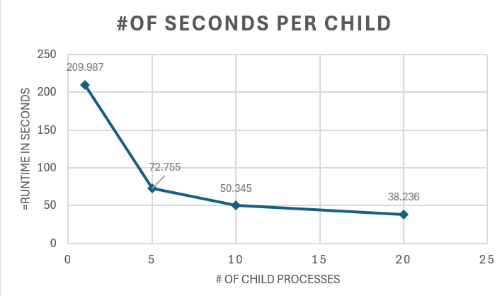

# System Programming Lab 11 Multiprocessing

For my implementation what I did is I took the existing mandel code and I made sure to add a timer of how long it takes x amount 
of child processes in seconds and then I made sure to change the color so it's not always black but instead each pixel is a random color. I then proceeded to make a for loop to make the 50 images depending on how many child processes you have.

As seen above is my graph based on how long it took to run the program and different amounts of processes. Which it seemed to be exponential but it started to head toward a horizontal asymptote because only so many child processes can help.

For my lab itself I have had issues with my computer running the mandel so to compile it I do 

ffmpeg -i mandel%3d.jpg mandel.mpg       (I do %3D)

then to run it I use ffplay mandel.mpg